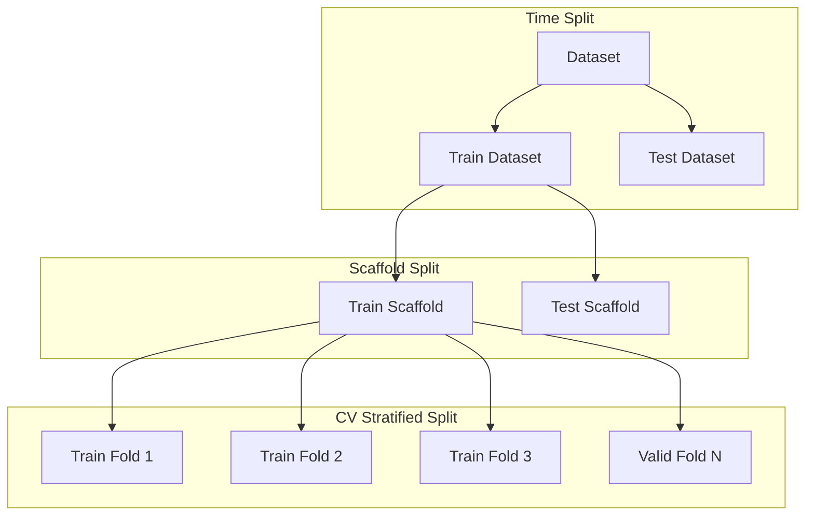

# Molecular Hierarchical Inter-Message Passing

## Backlog

**Polaris Dataset:**
- [ ] Run a set of hyperparameters ($\approx 10 000$) using `Train Dataset` and evaluate on `Test Dataset`
- [ ] Run a set of hyperparameters ($\approx 10 000$) using `Train Scaffold` and evaluate on `Test Dataset`

## Introduction
This is the code repository for our future paper title "Molecular Hierarchical Inter-Message Passing".

## Datasets
We investigate 2 datasets, each containing multiple regression tasks:

MoleculeNet:
- ESOL
- FreeSolv
- Lipophilicty

Polaris:
- HLM
- KSOL
- LogD
- MDR1-MDCKII
- MLM
- pIC50 (MERS-CoV Mpro)
- pIC50 (SARS-CoV-2 Mpro)

## Data Splitting
The Polaris dataset was originally part of the [Antiviral Drug Discovery 2025](https://polarishub.io/competitions/asap-discovery/antiviral-drug-discovery-2025) challenge. During the competition we were provided with the labeled `Train Dataset` molecules and the unlabeled `Test Dataset` molecules. Aim of the challenge was to learn from the `Train Dataset` in order to submit the best prediction of the `Test Dataset`. The Diagram below shows our splitting strategy.

1. Dataset (All data): Is split using time-split (decided by the company) into `Train Dataset` and `Test Dataset`
2. `Train Dataset` is split according to a scaffold split into a `Train Scaffold` and a `Test Scaffold`. This is done to check whether our trained model generalizes well.
3. `Train Scaffold` is split into k-folds using a stratified k-fold cross validation, ensuring similar target distributions within each fold.

During the training process, we test our model performance on the `Train Scaffold` for different sets of hyperparameters. For each hyperparameter configuration we obtain a mean validation loss after performing cross-validation. Furthermore, we train on the entire `Train Scaffold` to obtain an MAE on the `Test Scaffold` to get an indication of the models generalization capabilities. Finally, still using the same hyperparameters, we also train on the `Train Dataset` and evaluate the MSE on the `Test Dataset`. This allows us to draw conclusions concerning the model selection strengths with respects to the cross-validation MSE loss, the `Test Scaffold` MSE loss and finally the `Test Dataset` MSE loss.

In the case of the MoleculeNet dataset, the situation is slightly different, because this dataset was not part of a challenge, and the `Test Dataset` labels are already provided. Therefore, the approach highlighted above does not apply in this case. Instead, we focus on a traditional train/test split to evaluate the performance of our model.

For consistency reasons, we will keep the same terminology as described in the diagram above, which is also reflected in the code, meaning that for the MoleculeNet Datasets we do not have a `Dataset` or a `Test Dataset`. Instead, the `Train Dataset` will mean to be the entire dataset in this case.
